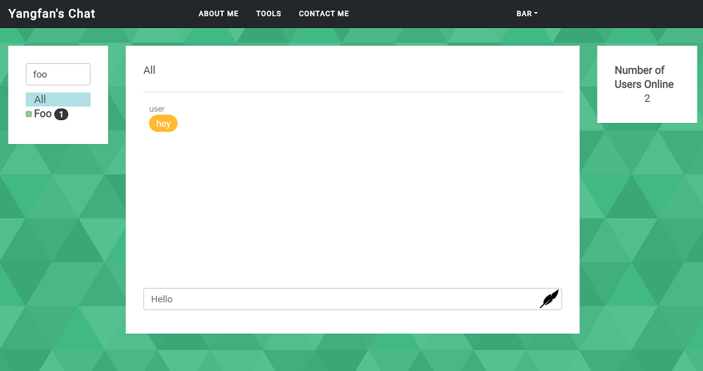
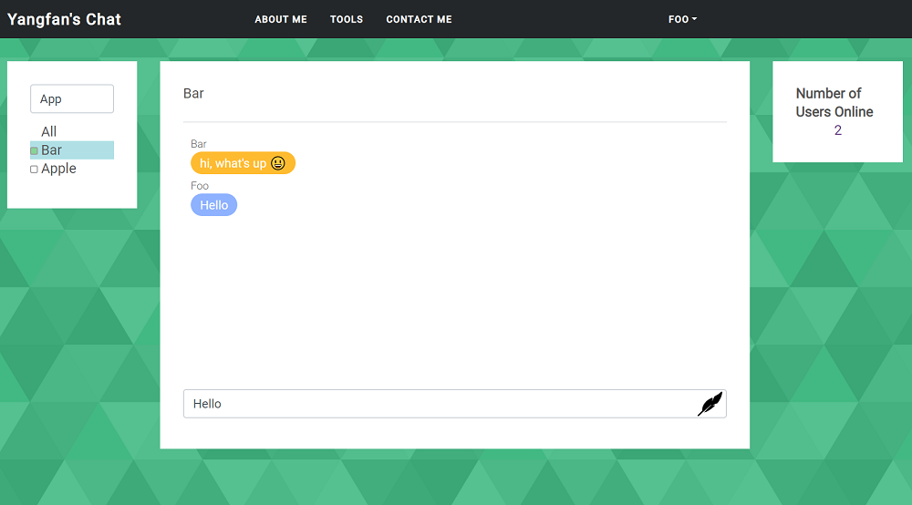

# yangfan-chat
An experimental chat-app with features such as user account flow, private chatting, and 
room chatting (not yet available).
###  backend
Main modules used are directly provided out of box by Spring
* Spring Boot
* Spring WebSocket
* Spring Redis (User Session Storage)
* Spring JPA (MySQL)
* etc
### frontend
* Vue, with VueX and VueRouter (failed to incorporate for SPA)
* BoostrapVue (Migrating to Vuetify)
* Spring MVC with thymeleaf to go hand in hand with Spring Security to control user
registration, login and logout flow
### example usage & screenshots
To simulate multiple user sessions as a single user: 

* Create an user in any browser

* Create a different user in a different browser or have another session in an incognito window.
 
